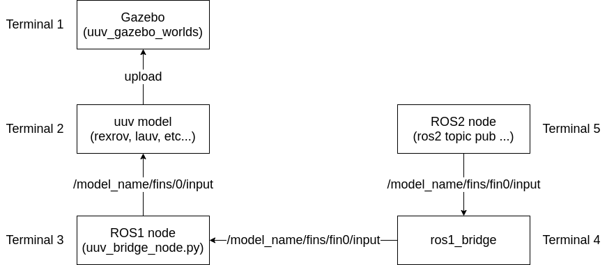

# UUV bridge
Convert UUV Simulator actuator topic name to ROS2 style topic name.  

|ROS2 topic|ROS1 topic|
|:--|:--|
|/lauv/fins/fins0/input|/lauv/fins/0/input|
|/lauv/fins/fins1/input|/lauv/fins/1/input|
|/lauv/fins/fins2/input|/lauv/fins/2/input|
|/lauv/fins/fins3/input|/lauv/fins/3/input|
|/lauv/thrusters/thruster0/input|/lauv/thrusters/0/input|



## Build

```console
$ cd path/to/above/uuv_bridge
$ catkin_make
```

## Install

```console
$ sudo -s
# source /opt/ros/noetic/setup.bash
# catkin_make -DCMAKE_INSTALL_PREFIX=/opt/ros/noetic install
```

## Run

```console
$ source /opt/ros/noetic/setup.bash
$ rosrun uuv_bridge uuv_bridge_node.py
```